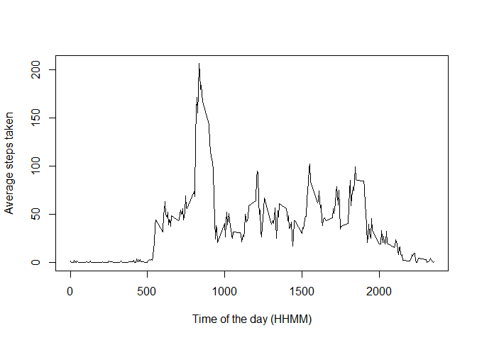

# Reproducible Research: Peer Assessment 1


## Loading and preprocessing the data


```r
require(dplyr)
```

```
## Loading required package: dplyr
## 
## Attaching package: 'dplyr'
## 
## The following object is masked from 'package:stats':
## 
##     filter
## 
## The following objects are masked from 'package:base':
## 
##     intersect, setdiff, setequal, union
```

```r
activity <-read.csv("activity.csv",header=TRUE)
act_tb<-tbl_df(activity)
head(act_tb)
```

```
## Source: local data frame [6 x 3]
## 
##   steps       date interval
## 1    NA 2012-10-01        0
## 2    NA 2012-10-01        5
## 3    NA 2012-10-01       10
## 4    NA 2012-10-01       15
## 5    NA 2012-10-01       20
## 6    NA 2012-10-01       25
```

## What is mean total number of steps taken per day?

First the data is grouped by day, and then the average number of steps is computed for each day


```r
by_date<-group_by(act_tb,date ) %>%
summarize(pasos=sum(steps))    
hist(by_date$pasos,breaks=20, main="Histogram of steps taken per day", col="blue", xlab="Number of Steps")
```

 

The average daily steps is 10766.19 and the median is 10765

## What is the average daily activity pattern? 
For the activity pattern, the data is grouped by interval of time (HHMM) 


```r
by_interval<-group_by(act_tb,interval) %>% summarize(media=mean(steps,na.rm=TRUE))

plot(by_interval$interval,by_interval$media,type='l',main="",xlab="Time of the day (HHMM)",
     ylab="Average steps taken")
```

 

```r
temp<-filter(by_interval,media==max(media))
```
On average across all the days in the dataset, the interval that contains the maximum number of steps is 835 with an average steps of 206.1698


## Imputing missing values


## Are there differences in activity patterns between weekdays and weekends?
