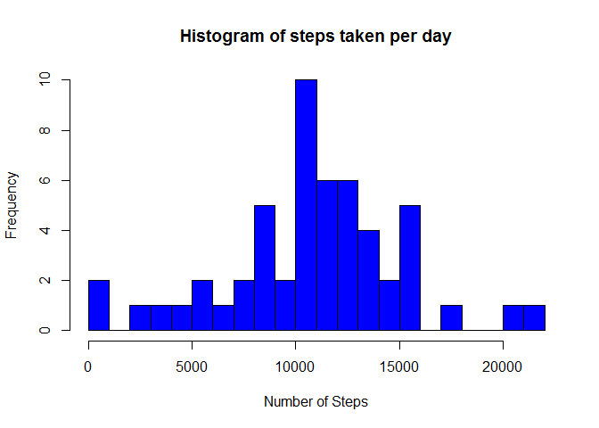

# Reproducible Research: Peer Assessment 1


## Loading and preprocessing the data


```r
library(dplyr)
```

```
## 
## Attaching package: 'dplyr'
## 
## The following object is masked from 'package:stats':
## 
##     filter
## 
## The following objects are masked from 'package:base':
## 
##     intersect, setdiff, setequal, union
```

```r
activity <-read.csv("activity.csv",header=TRUE)
head(activity)
```

```
##   steps       date interval
## 1    NA 2012-10-01        0
## 2    NA 2012-10-01        5
## 3    NA 2012-10-01       10
## 4    NA 2012-10-01       15
## 5    NA 2012-10-01       20
## 6    NA 2012-10-01       25
```

```r
act_tb<-tbl_df(activity)
```

## What is mean total number of steps taken per day?


```r
by_date<-group_by(act_tb,date ) %>%
summarize(pasos=sum(steps))    
hist(by_date$pasos,breaks=20, main="Histogram of steps taken per day", col="blue", xlab="Number of Steps")
```

 

The average daily steps is 10766.19 and the median is 10765

## What is the average daily activity pattern? activityPattern

```r
by_interval<-group_by(act_tb,interval) %>% summarize(media=mean(steps,na.rm=TRUE))

plot(by_interval$interval,by_interval$media,type='l')
```

 

## Imputing missing values


## Are there differences in activity patterns between weekdays and weekends?
