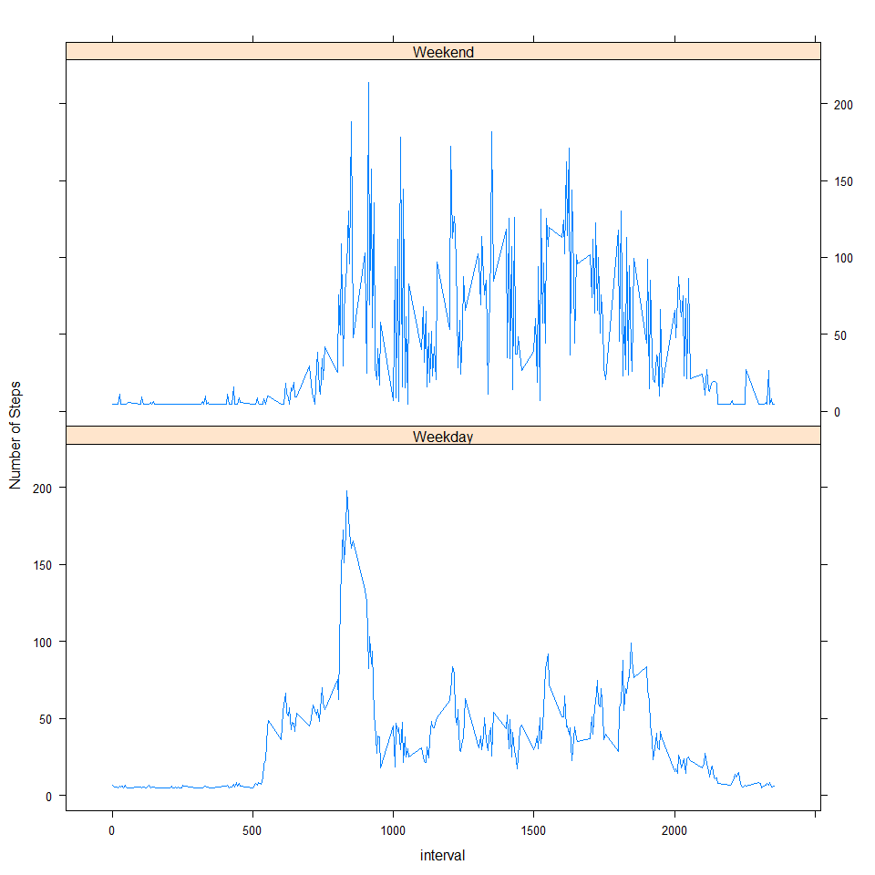

# Reproducible Research: Peer Assessment 1


## Loading and preprocessing the data

The dplyr package is used to manipulate the data.


```r
require(dplyr)
```

```
## Loading required package: dplyr
## 
## Attaching package: 'dplyr'
## 
## The following object is masked from 'package:stats':
## 
##     filter
## 
## The following objects are masked from 'package:base':
## 
##     intersect, setdiff, setequal, union
```

```r
activity <-read.csv("activity.csv",header=TRUE)
act_tb<-tbl_df(activity)
head(act_tb)
```

```
## Source: local data frame [6 x 3]
## 
##   steps       date interval
## 1    NA 2012-10-01        0
## 2    NA 2012-10-01        5
## 3    NA 2012-10-01       10
## 4    NA 2012-10-01       15
## 5    NA 2012-10-01       20
## 6    NA 2012-10-01       25
```

## What is mean total number of steps taken per day?

To compute the average number of steps taken per day, first the data is grouped by day, and then the mean value  for each day is calculated.


```r
by_date<-group_by(act_tb,date ) %>%
         summarize(pasos=sum(steps)) 

hist(by_date$pasos,breaks=20, main="Histogram of steps taken per day", 
     col="blue", xlab="Number of Steps")
```

 

The average daily steps is 10766.19 and the median is 10765.

## What is the average daily activity pattern? 
For the activity pattern, the data is grouped by interval of time (HHMM) 


```r
by_interval<-group_by(act_tb,interval) %>% summarize(media=mean(steps,na.rm=TRUE))

plot(by_interval$interval,by_interval$media,type='l',main="",xlab="Time of the day (HHMM)",
     ylab="Average steps taken")
```

 


```r
temp<-filter(by_interval,media==max(media))
```
On average across all the days in the dataset, the interval that contains the maximum number of steps is 835 with an average steps of 206.2.


## Imputing missing values

The total number of missing values in the dataset is 2304.

To decide the strategy to follow for filling in all of the missing values in the dataset, the distribution of the missing data was analized. 


```r
temp <- group_by(act_tb,interval) %>%
summarize(MV=sum(is.na(steps)))
temp
```

```
## Source: local data frame [288 x 2]
## 
##    interval MV
## 1         0  8
## 2         5  8
## 3        10  8
## 4        15  8
## 5        20  8
## 6        25  8
## 7        30  8
## 8        35  8
## 9        40  8
## 10       45  8
## ..      ... ..
```

```r
min(temp$MV) ; max(temp$MV)
```

```
## [1] 8
```

```
## [1] 8
```

```r
filter(by_date,is.na(pasos))
```

```
## Source: local data frame [8 x 2]
## 
##         date pasos
## 1 2012-10-01    NA
## 2 2012-10-08    NA
## 3 2012-11-01    NA
## 4 2012-11-04    NA
## 5 2012-11-09    NA
## 6 2012-11-10    NA
## 7 2012-11-14    NA
## 8 2012-11-30    NA
```

The missing values are evenly distributed across the intervals and in particular they correspond to eight specific days.  For this reason, each missing value will be replaced with the mean steps value.


```r
new_act<-act_tb
new_act$steps[is.na(new_act$steps)]<-mean(new_act$steps,na.rm=TRUE)
head(new_act)
```

```
## Source: local data frame [6 x 3]
## 
##     steps       date interval
## 1 37.3826 2012-10-01        0
## 2 37.3826 2012-10-01        5
## 3 37.3826 2012-10-01       10
## 4 37.3826 2012-10-01       15
## 5 37.3826 2012-10-01       20
## 6 37.3826 2012-10-01       25
```

Using the new dataset with the NA values replaced, the average number of steps taken per day
is computed.


```r
by_date<-group_by(new_act,date ) %>%
         summarize(pasos=sum(steps)) 

hist(by_date$pasos,breaks=20, main="Histogram of steps taken per day", 
     col="red", xlab="Number of Steps")
```

 

The average daily steps is 10766.19 and the median is 10766.19.

After replacing the missing values, the mean value remains the same and the median changes. Now the mean and the median values are equal.


## Are there differences in activity patterns between weekdays and weekends?


```r
require(lubridate)
```

```
## Loading required package: lubridate
```

```r
require(lattice)
```

```
## Loading required package: lattice
```

```r
new_act$dia<-weekdays(as.Date(new_act$date))

temp<-tbl_df(new_act)
temp_weekdays<-filter(temp,dia!=c("Saturday","Sunday")) %>%
               group_by(interval) %>% summarize(media=mean(steps,na.rm=TRUE)) %>%
               mutate(tipo="Weekday")
temp_weekends<-filter(temp,dia==c("Saturday","Sunday")) %>%
               group_by(interval) %>% summarize(media=mean(steps,na.rm=TRUE)) %>%
               mutate(tipo ="Weekend")
final<-rbind(temp_weekends,temp_weekdays)

xyplot(media~interval|tipo,data=final,type="l",layout=c(1,2),ylab="Number of Steps")
```

 


Before 10am the subject seems to be more active during weekdays compared to weekends. After that time subject seems more active during the weekends.


